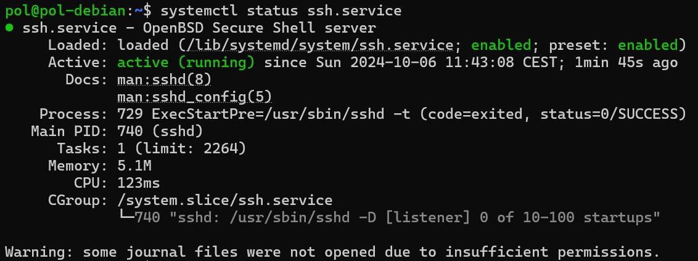
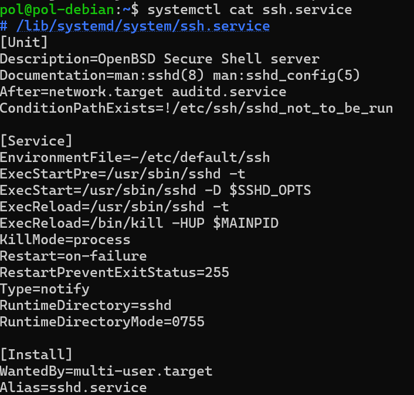
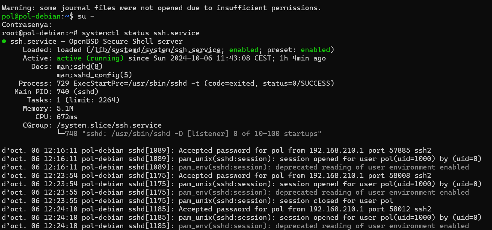
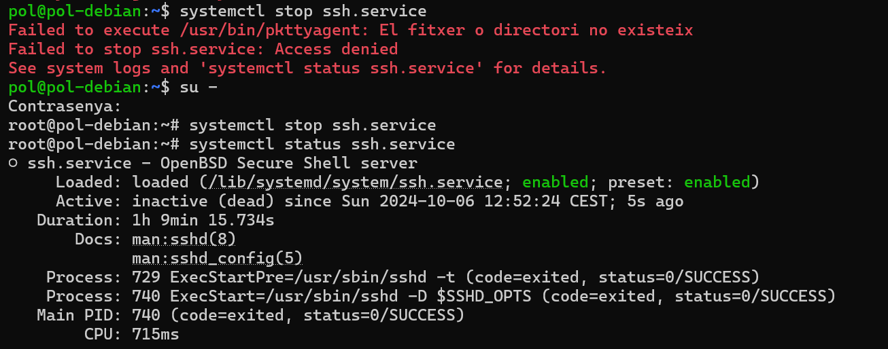
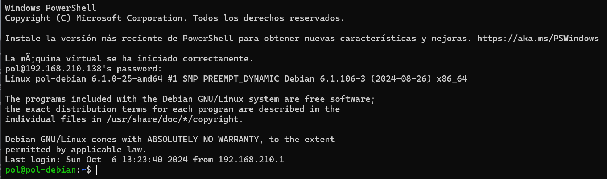

## Investigació de la Unitat de `ssh.service`


### Descripció
- **Nom de la unitat**: `ssh.service`
- **Funció**: El servei `ssh.service` utilitza un protocol de control remot que permet als usuaris modificar els seus servidors a través d'Internet. També permet autenticar a un usuari remot i una comunicació bilateral entre el client i el host.

### Documentació
- **Manual de SSHD**: La documentació relacionada es pot trobar als manuals en `base64` o `.txt` a la carpeta sshd_manuals.
  - `man:sshd(8)` – documentació general sobre SSH.
  - `man:sshd_config(5)` – documentació de configuració del servei SSH.

### Dependències i condicions
També es pot veure que ssh necessita que la xarxa funcioni correctament. Per aquest motiu, amb les següents comandes:
```bash
After=network.target auditd.service
ConditionPathExists=!/etc/ssh/sshd_not_to_be_run
```
Es pot veure com ssh s'executa després que la xarxa estigui disponible, i també que el fitxer de pas no existeixi.

### Comandes start/stop
SSH utilitza notificacions per indicar quan està preparat.
- **ExecStartPre**: aquesta comanda executarà `/usr/sbin/sshd -t` abans que s'iniciï.
- **ExecStart**: Després executa -> `/usr/sbin/sshd -D $SSHD_OPTS` L'opció -D per executar-se en primer pla.
- **ExecReload**: Pot reiniciar la configuració sense haver de parar totalment.
```bash 
/usr/sbin/sshd -t
/bin/kill -HUP $MAINPID
``` 

Per iniciar `systemctl start ssh.service`.
Per parar `systemctl stop ssh.service`.
Per reiniciar `systemctl reset ssh.service`.

### Temps d'execució 
Es pot veure el temps d'execució del ssh a la següent línia:

També es mostra que el procés 729 ha tingut èxit (0:success) en executar-se. Que ha realitzat una tasca i ocupa 5,1 MB a la memòria mentre que ha tingut un T = 0,672 segons.

### TroubleShooting


Per resoldre aquest WARNING s'ha executat la mateixa comanda com a root amb permisos `su -`.
Són els registres (log) de connexió de l'usuari al sistema mitjançant SSH.


Com es pot veure a continuació, per poder executar, parar o reiniciar el servei ssh cal tenir permissos d'administrador i també es pot veure a ACTIVE: inactive, que el servei està en STOP.


# Disseny d'un Escenari Real per a un Script d'Arrancada

## Descripció de l'Escenari

Es dissenyarà un script d'arrancada que s'encarregarà d'iniciar una màquina virtual de VMware automàticament quan un usuari inicia sessió en un terminal. Això facilita la feina diària, ja que l'usuari no ha de recordar fer-ho manualment cada vegada que inicia sessió.

### Tasca a Realitzar

L'objectiu del script és iniciar una màquina virtual que conté un servidor web que ha de ser accessible per a diversos usuaris. Un cop la màquina virtual estigui en funcionament, l'usuari podrà connectar-se a ella mitjançant SSH per gestionar el servidor.

## Contingut del Script d'Arrancada

```powershell
# Ruta al fitxer .vmx de la màquina virtual
$vmxPath = "C:\Users\Pol Marsol\OneDrive\Documentos\Virtual Machines\D - Prova 4.2.2\D - Prova 4.2.2.vmx"

# Ruta al fitxer executables vmrun
$vmrunPath = "C:\Program Files (x86)\VMware\VMware Workstation\vmrun.exe"

# Comprovem si vmrun existeix
if (-Not (Test-Path $vmrunPath)) {
    Write-Output "El fitxer vmrun no s'ha trobat. Comprova la ruta."
    exit 1
}

# Arrenquem la màquina virtual
Start-Process -FilePath $vmrunPath -ArgumentList "start", $vmxPath, "nogui" -NoNewWindow -Wait

# Comprovem l'estat de sortida
if ($LASTEXITCODE -eq 0) {
    Write-Output "La màquina virtual s'ha iniciat correctament."
    
    Start-Sleep -Seconds 2 # Esperem que la VM estigui llesta
    
    # Connexió a la VM mitjançant SSH
    ssh pol@192.168.210.138
} else {
    Write-Output "Error al iniciar la màquina virtual."
}
```

Has de desar aquest fitxer example.ps1 a C:/Home/User, 
C:\Users\Pol Marsol\OneDrive\Documentos\WindowsPowerShell i obrir el fitxer: Microsoft.PowerShell_profile
i adjuntar-li aquesta comanda: & "C:\Users\Pol Marsol\iniciar_vm.ps1"
i guardar els canvis.


